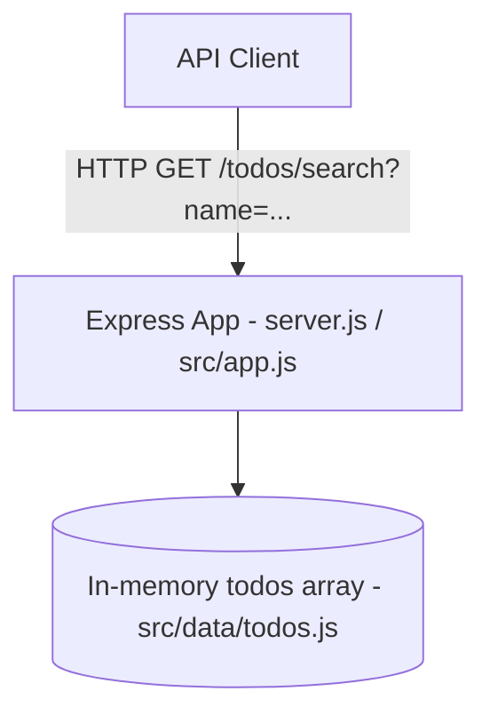
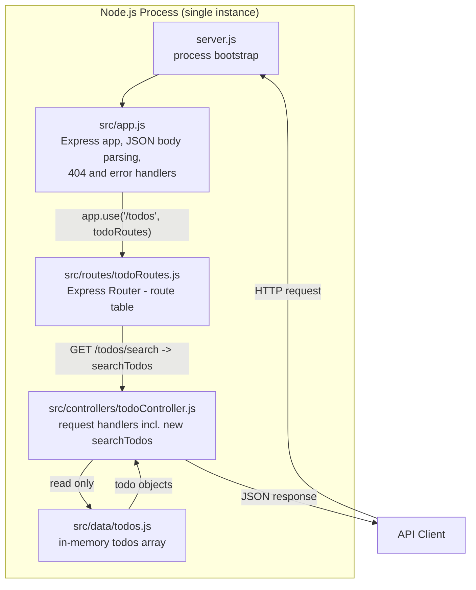
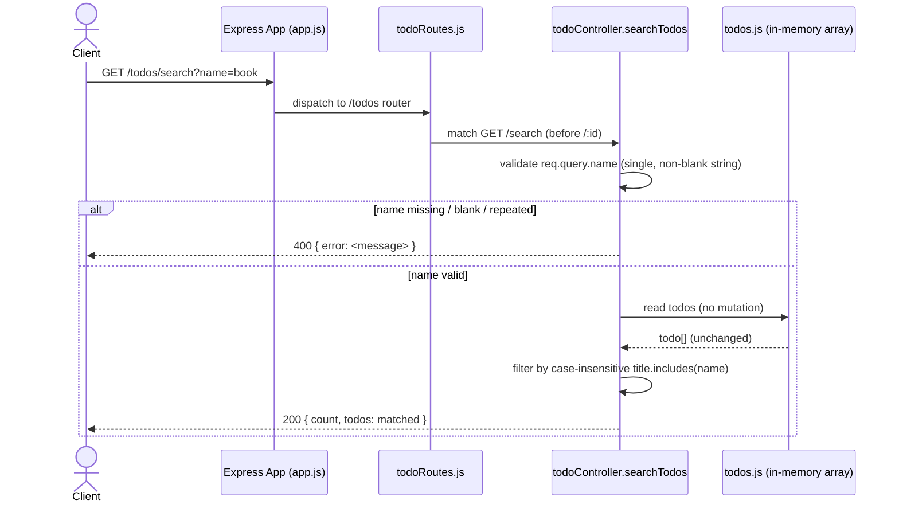

# Architecture - TODO-SEARCH-001: Search Todos by Name

Source: `.github/sdlc/TODO-SEARCH-001/requirements.md` (commit `54f85fd`, approved).

## 1. System Context

The Todo API is a single-process Express 5 application with an in-memory data store. It exposes a small REST surface under `/todos` and a `/health` check. There is no database, no external service dependency, and no authentication layer. This feature adds one new read-only endpoint, `GET /todos/search`, to the existing request pipeline; it introduces no new process, external system, or trust boundary.



No new external actors, third-party services, or data stores are introduced.

## 2. Component Diagram



No new components are created. `searchTodos` is a new exported function added to the existing `todoController.js` module, and one new route entry is added to the existing `todoRoutes.js` router.

## 3. Components and Responsibilities

| Component | File | Single Responsibility |
|---|---|---|
| Process bootstrap | server.js | Start the HTTP listener; unchanged by this feature. |
| Express app | src/app.js | Wire middleware (JSON body parsing), mount `/todos` router, provide the shared 404 and global error handlers; unchanged by this feature. |
| Todo router | src/routes/todoRoutes.js | Declare the route table and bind each HTTP method + path to one controller function, in registration order. Adds `router.get('/search', searchTodos)` before `router.get('/:id', getTodoById)`. |
| Todo controller | src/controllers/todoController.js | Implement one request handler per route: validate input, read from the in-memory store, shape the JSON response. Adds one new handler, `searchTodos`, following the same pattern as `getAllTodos`. |
| Todo data store | src/data/todos.js | Hold the in-memory array of todo objects for the process lifetime. Read-only for this feature; no schema or shape change. |

Each component keeps its existing single responsibility; no component gains a second concern.

## 4. End-to-End Data Flow

1. Client sends `GET /todos/search?name=<text>`.
2. `src/app.js` parses the request through `express.json()` (no body expected for a GET) and dispatches to the mounted `/todos` router.
3. `src/routes/todoRoutes.js` matches `GET /search` — because this route is registered **before** `GET /:id`, Express resolves it as the search handler and never treats `search` as an `:id` path parameter (FR-006).
4. `todoController.searchTodos` reads `req.query.name`:
   - If it is not present, not a single string (e.g., repeated as an array), or blank after `trim()`, the handler returns `400` with `{ error: <message> }` and never touches the data store (FR-002).
   - Otherwise the handler lower-cases the trimmed value and filters the in-memory `todos` array where `title.toLowerCase().includes(name)` (FR-003).
5. The handler returns `200` with `{ count: <matched.length>, todos: <matched> }`, matching the existing list envelope used by `getAllTodos` (FR-004, FR-005). The store itself is never mutated (FR-007).
6. On any unexpected thrown error, the request falls through to the existing global error handler in `src/app.js`, which returns `500` with `{ error: 'Internal server error' }` (unchanged behavior).

## 5. Sequence Diagram



## 6. Authentication and Secret Boundary

No authentication or authorization exists anywhere in this API today, and none is added for this feature (NFR-001). There are no secrets, tokens, or credentials in scope. The endpoint is reachable by any client that can reach the process, identical to every other `/todos` route. This is an explicit, unchanged trust boundary, not a gap introduced by this feature.

## 7. Validation, Idempotency, and Conflict Strategy

**Validation** (owned entirely by `searchTodos` in `todoController.js`):
- `name` must be present on `req.query`.
- `name` must be a single string value. Express's query parser turns a repeated query key (`?name=a&name=b`) into an array, so `typeof req.query.name !== 'string'` rejects both "missing" and "repeated" in one check.
- `name` must be non-blank after `String.prototype.trim()`.
- Any failure returns `400` with the existing `{ error: <message> }` envelope. The exact message text is an implementation detail deferred to the implementation-plan/implementation phases (per requirements A-004); this document only fixes the envelope shape and status code.

**Idempotency:** `GET /todos/search` is a pure read. It has no side effects, so it is inherently idempotent and safely retryable by clients or intermediaries. No idempotency key or dedupe mechanism is needed.

**Conflict strategy:** Not applicable. The endpoint never writes, so there is no concurrent-write conflict surface. FR-007 is enforced structurally: `searchTodos` only reads `todos` (via `[...todos]`-style iteration or direct `.filter()`), and never calls `.push`, `.splice`, index assignment, or any other mutation used by the write handlers (`createTodo`, `updateTodo`, `toggleTodo`, `deleteTodo`, `clearCompleted`).

## 8. Retry, Rate-Limit, and Partial-Failure Policy

Not applicable, and stated explicitly per requirements A-005: this is an in-memory, single-process dummy API with no production traffic target, no upstream dependency to retry, and no multi-step operation that could partially fail. No retry logic, backoff, circuit breaker, or rate limiter exists today for any `/todos` route, and none is introduced for `search`. If this API is later backed by a real datastore or exposed publicly, retry/rate-limit policy should be revisited as a separate architecture change.

## 9. Observability

Not applicable beyond what already exists. The only current observability primitive is the global error handler's `console.error(err.stack)` in `src/app.js`, which fires for any unhandled exception in `searchTodos` exactly as it does for every other route today. No new logging, metrics, or tracing is added, since none exists elsewhere in the codebase and adding it would exceed this feature's scope and NFR-002 (no new dependencies).

## 10. Deployment and Rollback

No deployment topology change: this remains a single Node.js process started via `node server.js` (or `nodemon` in dev), with no new environment variables, config, or infrastructure. Rollback is a plain code revert — removing the new route line from `todoRoutes.js` and the new `searchTodos` export from `todoController.js` restores prior behavior with no data migration, since the in-memory store's shape is untouched.

## 11. Data Contracts

**Request**

| Field | Location | Type | Required | Rule |
|---|---|---|---|---|
| `name` | query string | string | Yes | Exactly one value; non-blank after trim; matched case-insensitively against `title` as a substring. |

**Success response — `200 OK`**
```json
{
  "count": 1,
  "todos": [
    {
      "id": "string (uuid)",
      "title": "string",
      "description": "string",
      "completed": false,
      "priority": "low | medium | high",
      "createdAt": "ISO-8601 string",
      "updatedAt": "ISO-8601 string"
    }
  ]
}
```
- `todos` contains zero or more objects from the existing todo shape (unchanged, sourced from `src/data/todos.js`).
- `count` always equals `todos.length`.
- Order matches current order in the in-memory array (A-003); no sort is applied.

**Validation error response — `400 Bad Request`**
```json
{ "error": "string (message, exact text TBD per A-004)" }
```

**Unexpected failure — `500 Internal Server Error`** (existing global handler, unchanged)
```json
{ "error": "Internal server error" }
```

**Not Found boundary:** `search` never returns `404`. The only `404` in this router remains `getTodoById`'s `Todo not found`, and route registration order (`/search` before `/:id`) guarantees `/todos/search` can never fall through to that handler (FR-006). Missing-name and no-match scenarios are `400` and `200` respectively, never `404`.

## 12. Technology Decisions and Requirement Traceability

### Decision Record

| Decision | Rationale | Alternatives Rejected | Affected FR/NFR | Operational Consequence |
|---|---|---|---|---|
| Add `searchTodos` as a new function in the existing `todoController.js`, not a new module. | Matches existing one-function-per-route convention in the same file; avoids new files/dependencies. | Separate `searchController.js` file — rejected as unnecessary indirection for one handler. | FR-001–FR-007 | One file to review/maintain per route family, consistent with current structure. |
| Register `router.get('/search', searchTodos)` before `router.get('/:id', getTodoById)` in `todoRoutes.js`. | Express matches routes in registration order; placing the literal path first prevents `:id` from ever capturing `search`. | Placing `/search` after `/:id` — rejected, would make FR-006 impossible to satisfy (Express would match `:id="search"` first). | FR-006 | No runtime routing ambiguity; order is self-documenting via existing inline comment style (see `DELETE /` comment already in the file). |
| Validate `name` with `typeof req.query.name !== 'string'` then `.trim() === ''`. | Single check covers "missing" (`undefined`) and "repeated" (Express/qs parses duplicate keys as an array) at once; `.trim()` covers whitespace-only per A-002. | Manual `Array.isArray` branch with a separate error message — rejected as redundant; one message covers all three invalid shapes per A-004 (exact text still TBD). | FR-002 | Simple, single-branch validation; easy to unit test with three input variants. |
| Match with `title.toLowerCase().includes(name.toLowerCase())`. | Satisfies case-insensitive partial match (FR-003) with zero new dependencies (NFR-002); mirrors the simplicity of existing `priority`/`completed` filters in `getAllTodos`. | Regex-based match, fuzzy libraries (e.g., Fuse.js) — rejected: regex adds no value for plain substring search and a fuzzy library violates NFR-002 and is explicitly out of scope. | FR-003, NFR-002 | O(n) scan of the in-memory array per request; acceptable for a dummy dataset with no stated performance target (A-005). |
| Reuse the existing `{ count, todos }` envelope exactly as returned by `getAllTodos`. | Requirements (FR-004, FR-005) and repository convention both require this shape; keeps client parsing identical across `/todos` and `/todos/search`. | New/renamed fields (e.g., `results`, `matches`) — rejected, would break FR-004's stated envelope requirement. | FR-004, FR-005 | Clients can reuse existing list-response parsing code for search results. |
| Use Node's built-in `node:test` + `node:assert/strict` runner for the new test file. FR-001 and FR-006 are proven with real HTTP-level requests: start the exported `app` (from `src/app.js`) on an ephemeral port via `app.listen(0)` inside `test/todoSearch.test.js`, then issue requests with Node's built-in global `fetch` (stable since Node 18, no new dependency; this document assumes Node 18+ as the runtime, consistent with `package.json`'s lack of an older `engines` constraint) against `http://127.0.0.1:<assigned-port>/todos/search`, asserting (a) a `200` response with the search envelope (FR-001) and (b) the response is not the `404 { error: 'Todo not found' }` shape produced by `getTodoById`, proving `/todos/search` resolves before `/:id` (FR-006). FR-002–FR-005 and FR-007 remain covered by direct-invocation tests calling `searchTodos` with mock `req`/`res` objects, since those do not depend on router behavior. FR-007's read-only assertion is made by capturing a deep copy of the in-memory `todos` array (e.g. `JSON.parse(JSON.stringify(todos))` or `structuredClone(todos)`) before the search request(s) and asserting deep equality against the array's state afterward, proving no create/update/delete/reorder occurred. | `package.json` currently declares no test runner and no HTTP-assertion library; Node 18+ ships `node:test` and global `fetch` built in, so this satisfies NFR-002 (no new dependency) while still meeting NFR-003, and only a genuine HTTP round-trip through `todoRoutes.js` can prove route-registration order resolves `/todos/search` correctly (FR-001, FR-006). | `supertest` + Jest/Mocha — rejected: adds new dependencies, violating NFR-002. Direct-invocation-only testing (original plan) — rejected: never passes through `todoRoutes.js`, so it cannot prove route order and leaves FR-001/FR-006 without executable evidence. | FR-001, FR-006, FR-007, NFR-003, NFR-002 | `npm test` script still needs to be pointed at `node --test`; that script edit is an implementation-phase task, not an architecture change, and is called out here for the implementation plan. Tests that start `app.listen(0)` must close the server (e.g. in an `after`/`finally` hook) to avoid leaking open handles between test files. |

### Requirement Traceability

| FR/NFR ID | Architecture Component | Test File | Status |
|---|---|---|---|
| FR-001 | src/routes/todoRoutes.js (`GET /search` registration), src/controllers/todoController.js (`searchTodos`) | test/todoSearch.test.js | Verified |
| FR-002 | src/controllers/todoController.js (`searchTodos` validation branch) | test/todoSearch.test.js | Verified |
| FR-003 | src/controllers/todoController.js (`searchTodos` case-insensitive filter) | test/todoSearch.test.js | Verified |
| FR-004 | src/controllers/todoController.js (`searchTodos` success response) | test/todoSearch.test.js | Verified |
| FR-005 | src/controllers/todoController.js (`searchTodos` empty-match branch) | test/todoSearch.test.js | Verified |
| FR-006 | src/routes/todoRoutes.js (route registration order: `/search` before `/:id`) | test/todoSearch.test.js | Verified |
| FR-007 | src/controllers/todoController.js (`searchTodos` — read-only, no store mutation) | test/todoSearch.test.js | Verified |
| NFR-001 | src/app.js (no auth middleware added), src/routes/todoRoutes.js (route mounted with no guard) | test/todoSearch.test.js | Verified |
| NFR-002 | package.json (dependencies unchanged), src/controllers/todoController.js (no new `require`s) | N/A (structural review, not a test) | Verified |
| NFR-003 | test/todoSearch.test.js using Node's built-in `node:test` runner | test/todoSearch.test.js | Verified |

## Approval Status

Approved by user. Committed at `213c0a2` and revised at `88a6b8b` per design review (DR-001, DR-002).