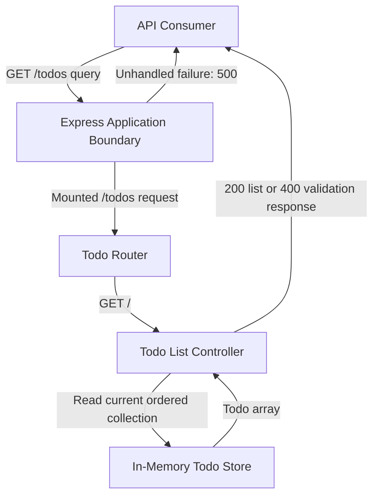
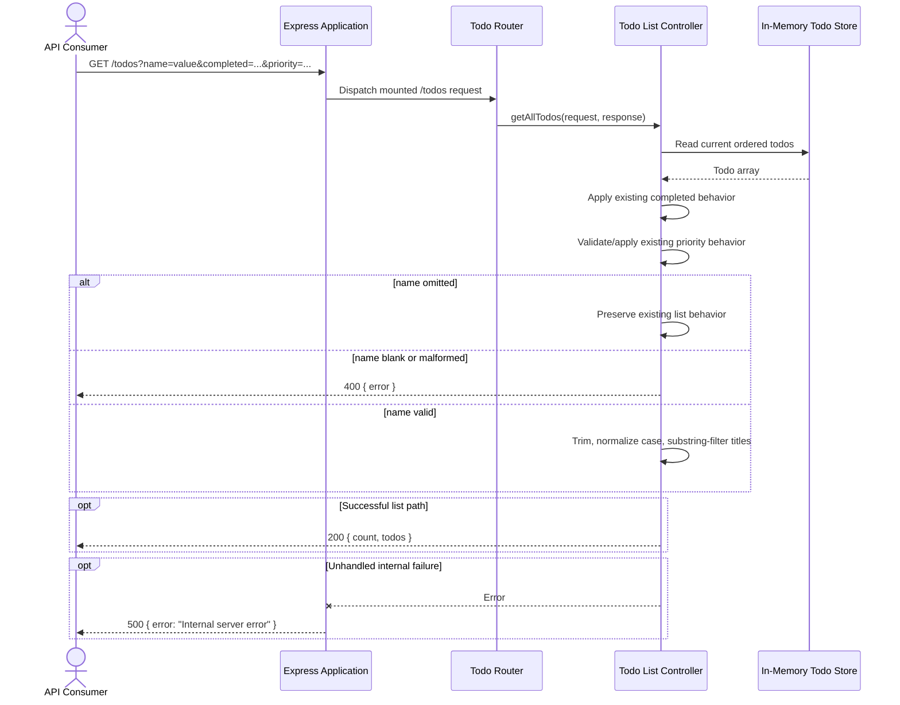

# TODO-SEARCH-NAME Architecture

| Field | Value |
| --- | --- |
| Story | `TODO-SEARCH-NAME` |
| Requirements baseline | Approved `requirements.md`, commit `9e71632cf939aab6e3aa650451f3fc86df090da1` |
| Architecture baseline | Commit `b2b35597fc9ab8ab90d6e0fd5b9fefac122c5dd3` |
| Architecture status | Design reviewed; material findings resolved; awaiting explicit approval |
| Design review | `design-review.md`, 2026-08-08 |
| Scope | Optional title search on `GET /todos` |

## 1. System Context

The system is a Node.js CommonJS API using Express 5. `GET /todos` is mounted by the application at `/todos`, routed to `getAllTodos`, and reads the process-local array exported by `src/data/todos.js`. The endpoint already supports optional `completed` and `priority` query filters and returns `{ count, todos }`.

This story adds an optional public query parameter named `name`. It maps to the existing todo `title`; it does not add or rename a data field. Search is a case-insensitive substring match after trimming the query value. All supplied filters use AND semantics. Array filtering preserves source order, so repeated reads are deterministic while the in-memory dataset is unchanged.

### Scope constraints

- Preserve the route, response envelope, todo field set, and behavior when `name` is omitted.
- Keep the implementation in the existing controller and use native JavaScript string and array operations.
- Read only the current in-memory dataset; do not add persistence, indexes, caches, or lifecycle changes.
- Do not add authentication, authorization, pagination, sorting, description search, deletion changes, compliance behavior, or todo fields.
- Do not change existing `completed` or `priority` semantics.
- Repository Markdown remains the documentation system of record.

### System boundary and actors

- **API consumer:** Sends HTTP requests and interprets HTTP status plus JSON responses.
- **Todo API process:** Parses the request, validates supported query values, filters todos, and creates the response.
- **In-memory todo store:** Supplies the current ordered todo collection for the lifetime of the process.

No external service, database, message broker, identity provider, or secret store participates in this request path.

## 2. Component Diagram using Mermaid `graph TD`



## 3. Components and Responsibilities

Each component has one explicit responsibility.

| Component | Single responsibility | Requirement ownership |
| --- | --- | --- |
| Express Application Boundary | Own application-wide middleware, route mounting, unknown-route handling, and conversion of unhandled failures to the existing non-sensitive 500 response. | Hard-error boundary supporting FR-005, FR-006 |
| Todo Router | Map `GET /todos` to the todo list controller without changing the public path or method. | FR-001, FR-007, NFR-001 |
| Todo List Controller | Validate list-query inputs and derive the ordered filtered result and response envelope from the current todo collection. | FR-001 through FR-007; NFR-001 through NFR-003 |
| In-Memory Todo Store | Hold and expose the current ordered todo objects for the process lifetime. | FR-004, NFR-002, NFR-003 |
| API Consumer | Supply query parameters and handle documented success and error outcomes. | Contract participant; no server requirement ownership |

No new search service or repository abstraction is introduced because search is one synchronous predicate over the existing process-local array. Splitting that predicate into a new layer would add indirection without creating an independent responsibility.

## 4. End-to-End Data Flow

1. The API consumer sends `GET /todos` with zero or more supported query parameters.
2. Express parses the query and the Todo Router dispatches the request to the Todo List Controller.
3. The controller takes a shallow ordered copy of the current in-memory todo array, preserving existing object fields and source order.
4. The controller applies the existing `completed` behavior when that parameter is present.
5. The controller applies the existing `priority` validation and filter behavior when that parameter is truthy. An unsupported truthy priority returns `400` using the existing error contract.
6. If `name` is omitted, the controller skips all name-specific validation and matching.
7. If `name` is present, the controller requires a scalar string, trims its leading and trailing whitespace, and rejects an empty trimmed value with `400`.
8. For a valid `name`, the controller compares a case-normalized title with the case-normalized trimmed search term using substring inclusion. This predicate is applied to the already-filtered result, producing AND semantics across all supplied filters.
9. The controller returns `200` with `{ count: result.length, todos: result }`. Native array filtering retains the existing todo objects and their relative order.
10. A valid search with no matches follows the same successful path and returns `{ count: 0, todos: [] }`; it is not a `Not Found` condition.

Validation and filtering are synchronous and local. No intermediate result is emitted, and no state is mutated by this endpoint.

## 5. Sequence Diagram using Mermaid `sequenceDiagram`



## 6. Authentication and Secret Boundary

Authentication and authorization changes are out of scope, and the current route has no identity boundary. The search value is untrusted request input but is used only for in-process string comparison; it is never evaluated as code, interpolated into a query language, or sent to another system.

The feature requires no credentials, configuration secrets, tokens, internal URLs, or PII to operate. However, `name` and todo titles are user-controlled free text and may contain personal or sensitive content, so the controller must not log the raw `name` value or matching titles. If authentication or authorization is introduced outside this story, its failures must remain explicit hard errors such as `401` or `403`; they must never be converted to an empty successful collection.

## 7. Validation, Idempotency, and Conflict Strategy

### Validation order

The order extends the current controller flow to minimize compatibility risk:

1. Read the current ordered todo collection into a shallow result array.
2. If `completed` is present, preserve the existing comparison behavior: only the exact string `true` selects completed todos; every other present value selects incomplete todos.
3. If `priority` is truthy, preserve existing validation against `low`, `medium`, and `high`; reject an unsupported value with `400`, otherwise filter by exact priority.
4. Detect `name` presence independently of truthiness so `name=` is not treated as omitted.
5. Require one scalar string value, trim it once, and return `400` if the trimmed value is empty.
6. Normalize the trimmed search term and each title with JavaScript case conversion, then apply substring matching.
7. Construct `count` from the final array length and return the final array.

This order preserves all requests that omit `name`. When both `priority` and `name` are malformed, the established priority validation runs first; both conditions are client errors and no successful list is returned.

### Determinism and idempotency

`GET /todos` is read-only and idempotent: it does not mutate todo data or request state. For an unchanged ordered in-memory dataset and identical parsed query inputs, deterministic trim, case conversion, substring comparison, and stable `Array.prototype.filter` ordering produce identical status, count, and ordered todo content. A process restart may regenerate seeded IDs; that is an existing dataset lifecycle change and is outside the unchanged-dataset guarantee.

### Conflict and outcome classification

| Condition | Outcome | Classification |
| --- | --- | --- |
| `name` omitted | Existing `GET /todos` status and content | Normal success or existing validation outcome |
| `name` present and blank after trimming | `400` with non-sensitive `{ error: string }`; no list envelope | Malformed client input |
| Valid `name` with one or more matches | `200` with established list envelope | Success |
| Valid `name` with no matches | `200` with `{ count: 0, todos: [] }` | Successful empty collection, not `404 Not Found` |
| Unknown route or todo ID on ID-addressed endpoints | Existing `404` behavior | Resource or route not found; unchanged by this story |
| Authentication/authorization failure if later introduced | Preserve `401`/`403` | Hard error, never an empty match set |
| Error propagated to the current global error middleware, including body-parser errors | Existing non-sensitive `500` response | Hard error, never an empty match set; the current middleware converts all propagated errors to `500` |
| Unexpected controller or infrastructure failure | Existing non-sensitive `500` response | Hard error, never an empty match set |

The read-only list operation has no write conflict, version conflict, duplicate creation, or locking strategy.

## 8. Retry, Rate-Limit, and Partial-Failure Policy

- **Server retries:** None. The request has no remote or fallible downstream operation worth retrying.
- **Client retries:** A consumer may retry the idempotent GET after a transient transport failure or `5xx`, subject to bounded backoff. A `400` is deterministic for the same input and must not be retried unchanged.
- **Rate limiting:** No application rate limiter is added. Existing deployment-edge policies, if any, remain authoritative and must surface their normal hard error (typically `429`) rather than an empty collection.
- **Partial failure:** Partial results are not allowed. The controller either returns the complete filtered snapshot available during the synchronous request or an error. It must not return a truncated `200` after parsing, authorization, or infrastructure failure.
- **Timeouts and circuit breakers:** None are introduced because there are no downstream calls.

## 9. Observability

The feature uses the existing application error boundary, which records unexpected server errors and returns a non-sensitive 500 body. Expected no-match results and input validation failures are not exceptions.

No new logging or telemetry dependency is justified for this local predicate. If platform request metrics already exist, operators can distinguish status classes (`2xx`, `4xx`, `5xx`) and latency for `GET /todos`; raw query values, todo titles, credentials, and response bodies must not be logged. A future metrics change may count requests and outcomes using bounded labels such as route and status class, never `name` values.

Verification evidence must cover successful matching, blank-input `400`, successful empty results, combined filters, response consistency, omitted-name compatibility, and repeatability. The package currently has no working test script, so Stage 5 must establish a focused executable test command before claiming automated acceptance evidence; native `node:test` is preferred to avoid a new test framework dependency.

## 10. Deployment and Rollback

The change is an in-place application-code deployment with no schema, data migration, environment variable, secret, network, or infrastructure change. Deploy the normal Node package artifact and verify the existing `/health` endpoint plus focused `GET /todos` acceptance cases.

Rollback consists of redeploying the immediately preceding application version. No data rollback or compatibility migration is required because the endpoint is read-only and the store remains in memory. Restarting during deploy or rollback resets/regenerates the current in-memory dataset according to existing behavior; this is not introduced by search. A rollback removes support for `name`, so consumers must not treat the optional parameter as universally available until rollout is complete.

## 11. Data Contracts

### Request contract

| Item | Contract |
| --- | --- |
| Method and path | `GET /todos` |
| `name` | Optional query parameter mapped to existing `title`; when present it must be one scalar string whose trimmed value is non-empty |
| `completed` | Existing optional behavior is unchanged: exact `true` means `true`; any other present value means `false` |
| `priority` | Existing optional behavior is unchanged: truthy values must be exactly `low`, `medium`, or `high`; an empty value is currently ignored |
| Filter composition | Logical AND across every supplied/applied filter |
| Search comparison | `title` contains trimmed `name` after case normalization; substring, not exact or prefix matching |
| Mutation | None |

The installed Express 5.2.1 application uses the default `simple` query parser. A runtime check confirms that repeated keys such as `?name=one&name=two` produce an array, while `?name=` and whitespace-only values remain scalar strings. Requirements define one optional `name` value but do not define repeated-key behavior. The architecture therefore rejects every non-string `name`, including repeated keys, as malformed `400` to keep matching deterministic and avoid implicit coercion. Approval of this architecture approves that public contract clarification.

### Successful response contract

```json
{
  "count": 1,
  "todos": [
    {
      "id": "existing-id",
      "title": "Read a book",
      "description": "Finish reading \"Clean Code\"",
      "completed": false,
      "priority": "low",
      "createdAt": "2026-08-02T09:00:00.000Z",
      "updatedAt": "2026-08-02T09:00:00.000Z"
    }
  ]
}
```

- Status is `200` for every valid list search, including no matches.
- The top-level members remain exactly `count` and `todos`.
- `count` is computed from `todos.length`.
- Returned todo objects retain their existing field set and values; no `name` field is added.
- Matching todos retain their source-array order.

No-match response:

```json
{
  "count": 0,
  "todos": []
}
```

### Error response contract

A blank or non-scalar `name` returns `400` using the repository's established error envelope:

```json
{
  "error": "name must be a non-empty string"
}
```

This response is not shaped as `{ count, todos }`. Existing priority errors, unknown-route `404` responses, and global `500` responses remain unchanged. Infrastructure, authentication, authorization, transport, and parsing failures introduced outside this scope must retain their real error status and must not be disguised as no-match success.

## 12. Technology Decisions and Requirement Traceability

### Technology decisions

| Decision | Rationale | Rejected alternatives | Affected requirements | Operational consequences |
| --- | --- | --- | --- | --- |
| Extend the existing CommonJS todo list controller | The controller already owns list-query validation, filtering, and the response envelope; this is the smallest repository-native ownership boundary. | New search service or repository layer: adds indirection without a separate data source or reusable domain boundary. Route-level filtering: mixes dispatch and business behavior. | FR-001, FR-003, FR-007, NFR-001 | No new module or runtime dependency; controller complexity grows by one validation branch and one predicate. |
| Use native `trim`, case normalization, `includes`, and `filter` | Directly implements trimmed, case-insensitive substring matching and preserves array order. | Regular expressions: unnecessary escaping and ReDoS risk. Exact/prefix matching: violates substring behavior. Locale-aware search library: adds semantics and dependency not required by the contract. | FR-002, FR-003, NFR-002 | Linear scan and string normalization per candidate; proportional and predictable for the current in-memory dataset. |
| Validate `name` inline after existing filters and detect presence independently of truthiness | Preserves the established controller flow and correctly distinguishes omission from blank input. | Generic schema middleware/library: new dependency and broader behavior change. Truthiness check: would incorrectly treat blank input as omitted. | FR-005, FR-007, NFR-001 | Stable `400` envelope; existing no-name behavior remains untouched. Priority error wins when both priority and name are invalid. |
| Return `200` with an empty collection for valid no-match | Collection search completed successfully; absence of members is not absence of the endpoint or an addressed resource. | `404`: conflates a valid empty query result with missing route/resource. `204`: loses the required response envelope. | FR-004, FR-006, NFR-003 | Consumers can process one list shape for all successful searches. Monitoring must not classify no-match as an error. |
| Keep the current in-memory ordered array and synchronous scan | Persistence and lifecycle changes are out of scope; stable filtering supplies deterministic order for unchanged data. | Database/index/cache: disproportionate, changes deployment and consistency boundaries, and violates scope. Sorting results: changes existing ordering semantics. | FR-004, FR-007, NFR-001, NFR-002, NFR-003 | Search is `O(n)` time and creates a filtered array; acceptable for current scope but not a scalability design for an unbounded dataset. |
| Use the built-in `node:test` runner for later focused verification | The package test script is currently non-working; the Node runtime can provide executable tests without selecting a third-party framework. | Leave tests manual: cannot prove NFR metrics. Add Jest/Mocha immediately: dependency and configuration overhead for a small API. | NFR-001, NFR-002, NFR-003 and AC-001 through AC-008 | Stage 5 must activate a working test command and use a small controller/HTTP harness; no dependency is added during architecture. |
| Reject repeated `name` keys with `400` | Express 5.2.1 parses repeated keys as arrays, while the requirements define one optional value. Requiring a string avoids coercion-dependent matching and gives deterministic validation. | First-value or last-value wins: silently discards caller input. Array coercion: creates undocumented comma-joined search semantics. | FR-001, FR-002, FR-005, NFR-002 | Consumers must send at most one `name`; focused negative verification must cover repeated keys. |

### Requirement traceability

| Requirement | Architecture owner | Architectural mechanism | Acceptance evidence target |
| --- | --- | --- | --- |
| FR-001 | Todo Router; Todo List Controller | Existing `GET /todos` route accepts optional parsed `name`. | AC-001 |
| FR-002 | Todo List Controller | Trim once; case-normalize title and term; substring-filter all matches. | AC-001, AC-002 |
| FR-003 | Todo List Controller | Sequential stable filters produce logical AND semantics. | AC-003 |
| FR-004 | Todo List Controller; In-Memory Todo Store | Read current array; preserve todo objects; derive `count` from final array. | AC-004 |
| FR-005 | Todo List Controller | Presence-aware validation rejects empty trimmed input with `400` and error envelope. | AC-005 |
| FR-006 | Todo List Controller | Empty filtered array is a normal `200` list response, never `404`. | AC-006 |
| FR-007 | Todo Router; Todo List Controller | Name branch is skipped when omitted; existing completed/priority flow and route remain. | AC-007 |
| NFR-001 | Todo Router; Todo List Controller | No-name requests follow the current path and contracts unchanged. | AC-007 |
| NFR-002 | Todo List Controller; In-Memory Todo Store | Pure synchronous predicates plus stable source order and no mutation. | AC-008 |
| NFR-003 | Todo List Controller | One final result array supplies both `todos` and `count`; object shape is not projected. | AC-004 |

### Edge-case and non-goal coverage

| Contract item | Architecture disposition |
| --- | --- |
| Omitted `name` | Skip name logic and preserve current behavior. |
| Empty or whitespace-only `name` | `400`; never omission and never successful list. |
| Case differences and surrounding whitespace | Normalize after trimming and match by substring. |
| Multiple matches | Return every match in existing order with accurate count. |
| Combined filters | Apply all predicates conjunctively while preserving current completed/priority semantics. |
| Authentication, persistence, pagination, sorting, description search, deletion, field, compliance, and existing-filter changes | Explicitly excluded; no component or deployment change is introduced for them. |

### Risks and TBDs

| Item | Status and mitigation |
| --- | --- |
| Repeated `name` query keys are unspecified in requirements. | Resolved by architecture decision: reject the non-string parsed value with `400`. Express 5.2.1 default-parser behavior was verified during Stage 3; approval of this document approves the clarification. |
| JavaScript default case conversion is not full locale-aware collation. | Accepted as the dependency-free interpretation of case-insensitive matching; revisit only if product requirements add locale-specific examples. |
| Linear scanning does not target an unbounded dataset. | Accepted for the explicitly current in-memory dataset; persistence/search indexing requires a future architecture change. |
| The package has no working automated test suite. | Stage 5 must establish and run a focused `node:test` command before implementation can be considered verified. |

## 13. Design Review Dispositions

| Finding | Disposition | Resulting architecture decision |
| --- | --- | --- |
| DR-001: Free-text privacy classification was too strong. | Accepted and resolved. | No PII is required, but query values and titles are treated as potentially sensitive user-controlled text and are excluded from logs. |
| DR-002: Parser-error status preservation was unsupported by the repository. | Accepted and resolved. | The architecture records the existing catch-all `500` behavior and does not claim framework error statuses survive the global handler. Changing that middleware remains outside this story. |
| DR-003: Repeated-key behavior needed a final public contract decision. | Accepted and resolved. | Non-string `name` values, including arrays produced from repeated keys, receive `400`; no coercion or value selection is allowed. |
| Suggestion: add a schema-validation or search dependency. | Rejected. | Native type checks and string/array operations satisfy the approved scope with less dependency and behavior risk. |
| Suggestion: add rate limiting, pagination, or a search index in this story. | Rejected. | These changes exceed the approved in-memory search scope and would alter existing API or deployment boundaries. |
